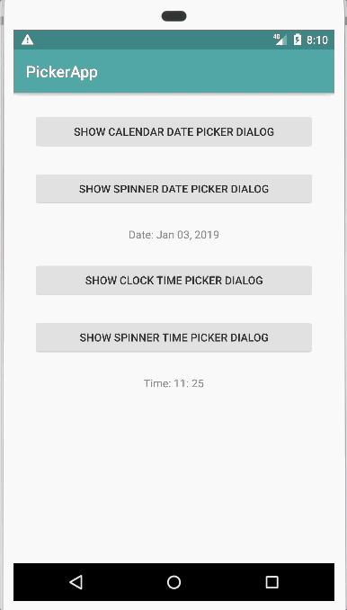

# Supported-Picker-Dialogs


## Installation
Step 1: Add jitpack.io repository to your root build.gradle
```java
allprojects {
 repositories {
    jcenter()
    maven { url "https://jitpack.io" }
 }
}
```
Step 2. Add this dependency
```java
dependencies {
    implementation 'com.github.Ibotta:supported-picker-dialogs:1.0'
}
```

## Usage
An Android DatePickerDialog and TimePickerDialog that works correctly on API 14+

The main reason for this library is to fix an issue with the spinner datepickermode and timepickermode style attributes not being applied to
the DatePickerDialog and TimePickerDialog on devices running Android 7.0. Google responded that they wont fix the issue for 7.0 through these tracked
issues: https://issuetracker.google.com/issues/37120178, https://issuetracker.google.com/issues/37119315.
It's a pretty strange issue with how the Android platform library handles these style attributes for the picker views.
Fear not though! This library adds a SupportedDatePickerDialog and SupportedTimePickerDialog to your project to fix the issue. These classes can be used in place
of any DatePickerDialog or TimePickerDialog and will continue to have the same functionality that these Android platform library's picker dialogs have.

## Development
SupportedDatePickerDialog style example:
```java
<style name="SpinnerDatePickerDialogTheme" parent="Theme.AppCompat.Light.Dialog">
    <!-- android:datePickerStyle was not added until API 21 -->
    <item name="android:datePickerStyle">@style/DatePickerStyle</item>
</style>

<style name="DatePickerStyle" parent="@android:style/Widget.Material.Light.DatePicker">
    <item name="android:datePickerMode">spinner</item>
</style>
```
SupportedDatePickerDialog code example:
```kotlin
val currentDate = Calendar.getInstance()
val year = currentDate.get(Calendar.YEAR)
val month = currentDate.get(Calendar.MONTH)
val dayOfMonth = currentDate.get(Calendar.DAY_OF_MONTH)
SupportedDatePickerDialog(this, R.style.SpinnerDatePickerDialogTheme, this, year, month, dayOfMonth).show()
```

SupportedTimePickerDialog style example:
```java
<style name="SpinnerTimePickerDialogTheme" parent="Theme.AppCompat.Light.Dialog">
    <!-- android:timePickerStyle was not added until API 21 -->
    <item name="android:timePickerStyle">@style/TimePickerStyle</item>
</style>

<style name="TimePickerStyle" parent="@android:style/Widget.Material.Light.TimePicker">
    <item name="android:timePickerMode">spinner</item>
</style>
```
SupportedTimePickerDialog code example:
```kotlin
val currentDate = Calendar.getInstance()
val month = currentDate.get(Calendar.MONTH)
val dayOfMonth = currentDate.get(Calendar.DAY_OF_MONTH)
SupportedTimePickerDialog(
    context = this,
    themeResId =  R.style.SpinnerTimePickerDialogTheme,
    timeSetListener = this,
    mInitialHourOfDay = month,
    mInitialMinute = dayOfMonth,
    mIs24HourView = true)
    .show()
```

SupportedDatePickerDialog on Android 7.0 (API 21):



SupportedTimePickerDialog on Android 7.0 (API 21):


